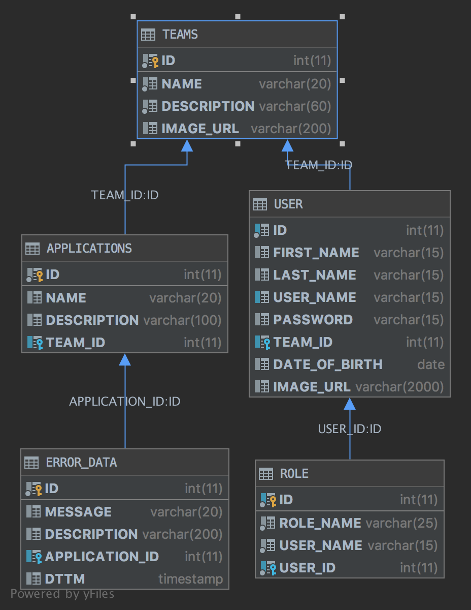

# Enterprise Java Individual Project

### TODO
- [x] add rest call for errors
- [x] add link to call rest call
- [x] add records to database
- [ ] unit tests
- [x] deploy to gke
- [x] deploy to aws
- [x] update design documents 
- [x] record 
---

## Project Statement
Enterprise wide dashboard for each team. 
Individual team members can login from the main page and get routed to the appropriate team page
Individual Members will be able to view all the applications the team would own and navigate to pages which would show stats like number of transactions per service and also errors encountered for that service

## Design
* Process Flow  

* Data Flow

* [User Stories](DesignDocument/UserStories.md)
* [Screen Design](DesignDocument/ScreenDesign.md)
* [Project Plan](ProjectPlan.md)
* [Technologies](Technologies.md)
* [Journal](Journal.md)
* External project source code - https://github.com/sudershanpothina/ErrorGenerator

# steps to install
* https://github.com/MadJavaEntF19/home/blob/master/setup/personalLaptopSetup.md
* java using tarball https://www.javahelps.com/2017/09/install-oracle-jdk-9-on-linux.html
* mysql using tarball https://support.rackspace.com/how-to/installing-mysql-server-on-ubuntu/
* install docker https://www.digitalocean.com/community/tutorials/how-to-install-and-use-docker-on-ubuntu-18-04
* install mysql docker docker run --name mysql -e MYSQL_ROOT_PASSWORD=student -d -p 3306:3306 mysql
